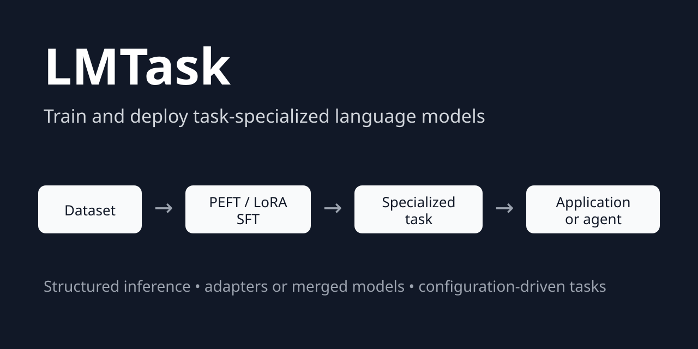
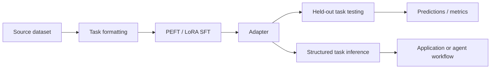

# LMTask

**Train and deploy task-specialized language models with PEFT/LoRA and
structured inference.**

[![PyPI][pypi-badge]][pypi-link]
[![CI][ci-badge]][ci-link]
[![Documentation][docs-badge]][docs-link]
[![Python 3.12+][python-badge]][python-link]
[![MIT License][license-badge]][license-link]

<p align="center">
  
</p>

LMTask turns an existing base or instruction-tuned language model into a
reusable, task-specific component. It provides one configuration-driven
workflow for preparing datasets, performing parameter-efficient supervised
fine-tuning, saving or merging adapters, testing specialized models on held-out
datasets, and running structured inference.

Use LMTask to build model-backed classifiers, extractors, taggers,
transformers, and generators that can be called directly from Python, the
command line, a service, or an agentic workflow.



**Benchmark snapshot:** Gemma 4 specialized on Financial PhraseBank achieves
**95.31% accuracy** and **94.34% macro-F1** on a 256-example held-out test set.
See [Benchmarks](BENCHMARKS.md) for the generated report and reproducibility
details.


<!-- markdown-toc start - Don't edit this section. Run M-x markdown-toc-refresh-toc -->
## Table of Contents

- [Why LMTask?](#why-lmtask)
  - [How LMTask is different](#how-lmtask-is-different)
- [Features](#features)
  - [Model specialization](#model-specialization)
  - [Task definition](#task-definition)
  - [Data preparation](#data-preparation)
  - [Reliable inference](#reliable-inference)
  - [Model testing and benchmarking](#model-testing-and-benchmarking)
- [Installation](#installation)
  - [Runtime expectations](#runtime-expectations)
- [Quick start](#quick-start)
- [Specialize a model with PEFT/LoRA SFT](#specialize-a-model-with-peftlora-sft)
- [Test and benchmark a specialized model](#test-and-benchmark-a-specialized-model)
- [Python API](#python-api)
- [Use an LMTask task in an agentic workflow](#use-an-lmtask-task-in-an-agentic-workflow)
- [Dataset configuration](#dataset-configuration)
- [Supported model configurations](#supported-model-configurations)
- [Documentation](#documentation)
- [Evidence and reproducibility](#evidence-and-reproducibility)
- [Alternatives](#alternatives)
- [Community](#community)
- [Changelog](#changelog)
- [License](#license)

<!-- markdown-toc end -->

## Why LMTask?

Low-level libraries such as Transformers, TRL, and PEFT provide the individual
training primitives. Agent frameworks primarily orchestrate calls among models
and tools. LMTask connects the layer between them: it creates the specialized,
model-backed task that an application or agent invokes.

LMTask keeps the complete task lifecycle together:

* the task's training and inference prompt contracts,
* dataset loading, preprocessing, and model-specific formatting,
* PEFT/LoRA supervised fine-tuning with TRL `SFTTrainer`,
* adapter persistence and optional model merging,
* held-out dataset testing through the same task inference path,
* configurable task-level scoring and reproducible benchmark reports,
* prediction export for downstream analysis and reproducibility,
* model loading, generation, response cleanup, and caching, and
* a stable request/response API for downstream software.

This makes LMTask a better fit than an orchestration-first framework when the
central problem is **specializing and deploying the model that performs a
particular task**. The two approaches are complementary: LMTask supplies a
trained capability, while an agent framework decides when to call it.

| Capability                           | Raw Transformers / TRL | Agent framework        | LMTask             |
|--------------------------------------|:----------------------:|:----------------------:|:------------------:|
| Dataset-to-SFT workflow              | Manual assembly        | No                     | Integrated         |
| PEFT/LoRA training                   | Low-level primitives   | No                     | Integrated         |
| Shared train/inference task contract | Manual                 | Usually inference only | Yes                |
| Adapter loading and merging          | Manual                 | No                     | Integrated         |
| Held-out task-level model testing    | Custom                 | Usually custom         | Integrated         |
| Partial-JSON recovery                | Manual                 | Varies                 | Built in           |
| Reusable task request/response API   | Custom                 | Tool wrapper           | Built in           |
| Agent planning and orchestration     | No                     | Yes                    | Integrates with it |


### How LMTask is different

LMTask is not primarily a general-purpose fine-tuning launcher or an agent
orchestrator. Its central abstraction is a **named task** whose data
preparation, training prompt, inference prompt, model configuration, response
handling, and application API remain connected throughout the task lifecycle.

That distinction matters after training. A trained adapter is only an artifact;
an LMTask task is an application-ready capability that also knows how to:

* format requests consistently with its training data;
* load the correct model and adapter;
* recover and validate structured responses;
* cache repeated requests;
* test and score a specialized model over a held-out dataset using the same
  inference path used by applications; and
* expose a stable request/response contract to services and agent tools.

In other words, LMTask focuses on turning model specialization into reusable
software, rather than ending the workflow when training produces an adapter.


## Features

### Model specialization

* Parameter-efficient supervised fine-tuning with PEFT and LoRA. The source
  model parameters remain frozen during training; LMTask optimizes the adapter
  parameters.
* Hugging Face Transformers and TRL `SFTTrainer` integration.
* Base-model and instruction-model workflows.
* Lightweight adapter output or optional adapter merging for deployment.
* Optional 4-bit and 8-bit quantization configuration.


### Task definition

* Configuration-driven classification, extraction, tagging, transformation,
  and generation tasks.
* Separate Jinja templates for training examples and inference requests.
* Native tokenizer chat-template integration with model-specific arguments.
* Explicit request and response classes for reusable application contracts.


### Data preparation

* Hugging Face datasets, local Arrow/text sources, Pandas data frames,
  `datasets.Dataset` instances, and Zensols stashes.
* Declarative preprocessing and postprocessing for mapping, filtering,
  shuffling, selecting, and renaming fields.
* Dataset sampling from the CLI so formatted examples can be inspected before
  training begins.


### Reliable inference

* Raw-text and machine-readable JSON task responses.
* Recovery of usable data from partial JSON when generation reaches a token
  limit.
* Streaming text generation.
* Optional SQLite response caching.
* Extension points for tokenizer, model, quantization, generation, output
  cleanup, dataset, and trainer behavior.

### Model testing and benchmarking

* Run a configured specialized model over a held-out Hugging Face
  `Dataset` using the same task request and generation path used at inference.
* Preserve gold fields from each test row while adding a configurable
  prediction column.
* Optionally retain raw model output for error analysis.
* Limit the number of test examples for smoke tests and development runs.
* Export standalone test predictions as CSV or newline-delimited JSON.
* Configure task-specific benchmark scoring in `trainconf/*`; the included
  classification scorer reports accuracy, micro/macro/weighted precision,
  recall and F1, per-class metrics, and invalid-output counts.
* Generate a machine-readable benchmark record and a rendered Markdown report
  together with the held-out predictions.

The repository includes task and training configurations for sentiment
analysis, named entity recognition, general generation, IMDB specialization,
Financial PhraseBank specialization, testing and benchmarking, and TinyStories
continuation.


## Installation

Install the released package from [PyPI][pypi]:

```bash
pip install zensols.lmtask
```


### Runtime expectations

LMTask's documented training workflow targets Linux with a CUDA-capable GPU.
The Linux environment also installs `bitsandbytes` and `xformers`. Dataset
preparation and some small-model inference may work in other environments, but
memory, quantization, and hardware requirements depend on the selected model.
Always review the upstream model license and access requirements.


## Quick start

List the configured tasks:

```bash
lmtask task
```

Run sentiment classification:

```bash
lmtask instruct sentiment \
  'The interface is excellent, but installation was frustrating.'
```

Run named entity recognition:

```bash
lmtask instruct ner 'UIC is in Chicago.'
```

Example structured output:

```yaml
model_output_json:
  - label: ORG
    span: [0, 3]
    text: UIC
  - label: O
    span: [4, 6]
    text: is
  - label: O
    span: [7, 9]
    text: in
  - label: LOC
    span: [10, 15]
    text: Chicago
```

Stream generation from a configured base model:

```bash
lmtask stream base_generate 'In a world long, long ago' \
  --override=lmtask_model_generate_args.temperature=0.9
```


## Specialize a model with PEFT/LoRA SFT

The canonical training example specializes Qwen 3 for IMDB sentiment
classification. First inspect the model-formatted dataset:

```bash
lmtask -c trainconf/imdb-qwen3.yml sample -m 1
```

Then train the adapter:

```bash
lmtask -c trainconf/imdb-qwen3.yml train
```

LMTask saves a PEFT adapter and can optionally save a model with that adapter
merged into the source checkpoint. The merge changes the exported deployment
artifact; it does not mean that the original model weights were directly
optimized during training.

See the complete [IMDB sentiment tutorial](examples/imdb-sentiment/README.md)
for the configuration lifecycle, outputs, and application integration.


## Test and benchmark a specialized model

LMTask can run a trained task over a held-out dataset through the same inference
path used by applications. The Financial PhraseBank Gemma 4 configuration in
[`trainconf/fpb-gemma4.yml`](trainconf/fpb-gemma4.yml) demonstrates the complete
workflow with deterministic stratified training, validation, and test
partitions.

To run only held-out inference and write predictions:

```bash
lmtask -c trainconf/fpb-gemma4.yml test \
  -o fpb-gemma4.jsonl -f json
```

CSV output is also available with `-f csv`.

To run the complete benchmark action:

```bash
lmtask -c trainconf/fpb-gemma4.yml benchmark
```

The benchmark action creates the trained model when it does not already exist,
otherwise it reuses the persisted training result. It similarly runs and
persists held-out testing when needed, computes the task-specific metrics
configured by `trainconf/*`, and renders the benchmark artifacts.

For Financial PhraseBank, the generated data layout is:

```text
data/fpb/gemma4/
├── model/
│   ├── base/
│   │   └── checkpoint-110/
│   │       └── ...
│   ├── peft/
│   │   ├── README.md
│   │   ├── adapter_config.json
│   │   └── adapter_model.safetensors
│   └── result/
│       ├── train-result.dat
│       └── test-result.dat
└── benchmark/
    ├── fpb_gemma4.jsonl
    ├── fpb_gemma4.json
    └── fpb_gemma4.md
```

The exact checkpoint files under `model/base/` are produced by the underlying
trainer and depend on its checkpoint configuration. `model/peft/` contains the
final PEFT adapter, while `model/result/train-result.dat` persists LMTask's
training result and statistics.

The benchmark-specific files are created only by the benchmark workflow:
`model/result/test-result.dat` persists the held-out test result,
`benchmark/fpb_gemma4.jsonl` contains the row-level gold labels and predictions,
`benchmark/fpb_gemma4.json` is the machine-readable benchmark record, and
`benchmark/fpb_gemma4.md` is the rendered human-readable report. Without running
`benchmark`, the `test-result.dat` and `benchmark/` artifacts are not created.

This keeps training-time validation distinct from final task-level testing.
Trainer statistics such as validation loss and token accuracy describe the
language-model objective on the validation split; benchmark metrics are
computed from predictions on the separate held-out test split.


## Python API

Use a configured task directly:

```python
import json
from zensols.lmtask import ApplicationFactory, InstructTaskRequest

factory = ApplicationFactory.get_task_factory()
task = factory.create('sentiment')

request = InstructTaskRequest(
    instruction='I love football.\nI hate olives.\nEarth is big.')
response = task.process(request)

print(json.dumps(response.model_output_json, indent=4))
```

Example result:

```json
[
  {"index": 0, "sentence": "I love football.", "label": "+"},
  {"index": 1, "sentence": "I hate olives.", "label": "-"},
  {"index": 2, "sentence": "Earth is big.", "label": "n"}
]
```


## Use an LMTask task in an agentic workflow

An LMTask task is an ordinary Python component. Wrap it as a narrow tool without
moving task logic into an agent prompt:

```python
from zensols.lmtask import ApplicationFactory, InstructTaskRequest

factory = ApplicationFactory.get_task_factory()
sentiment_task = factory.create('sentiment')


def classify_sentiment(text: str):
    """Classify one or more statements with the configured model."""
    response = sentiment_task.process(
        InstructTaskRequest(instruction=text))
    return response.model_output_json
```

The agent or application receives a stable callable capability. LMTask remains
responsible for model loading, task formatting, generation, response recovery,
and caching; the orchestration layer remains responsible for planning and tool
selection. A complete framework-neutral example is available in
[`examples/agent-tool`](examples/agent-tool).


## Dataset configuration

The IMDB example loads the source data, creates text labels, renames the input
field, shuffles the records, and selects a training subset:

```yaml
lmtask_dataset_train_source:
  # Load the public IMDB review dataset from the Hugging Face Hub.
  source: stanfordnlp/imdb
  load_args:
    # Use the source training split for adapter training.
    split: train
  pre_process: |-
    # Convert the numeric source label into the text expected by the task.
    ds = ds.map(lambda x: {
        'output': 'positive' if x['label'] == 1 else 'negative'})

    # Normalize the review field to the task's input contract.
    ds = ds.rename_column('text', 'instruction')

    # Make sampling reproducible, then use a small tutorial subset.
    ds = ds.shuffle(seed=0)
    ds = ds.select(range(1_000))
```

The associated task then renders each row with its training template and uses a
separate inference template after specialization. This minimizes train/serve
format skew. Test datasets deliberately leave chat-template formatting to the
task so held-out examples follow the same inference path as application
requests.


## Supported model configurations

| Family                   | Inference configuration | PEFT training configuration | Notes                                           |
|--------------------------|:-----------------------:|:---------------------------:|-------------------------------------------------|
| Llama 3                  | Yes                     | Yes                         | Base and instruction-model resources            |
| Qwen 3                   | Yes                     | Yes                         | Canonical IMDB example                          |
| DeepSeek-R1-Distill-Qwen | Yes                     | Yes                         | Qwen-derived configuration                      |
| Gemma 4                  | Yes                     | Yes                         | Includes a Transformers 5.5 compatibility patch |

The exact checkpoint, access policy, memory footprint, and license are governed
by the upstream model provider.


## Documentation

* [Full documentation][docs-link]
* [API reference](https://plandes.github.io/lmtask/api.html)
* [IMDB sentiment tutorial](examples/imdb-sentiment/README.md)
* [Agent-tool example](examples/agent-tool/README.md)
* [Benchmarks](BENCHMARKS.md)
* [Financial PhraseBank benchmark configuration](trainconf/fpb-gemma4.yml)
* [Contributing guide](CONTRIBUTING.md)


## Evidence and reproducibility

LMTask separates training-time validation from held-out task evaluation.
`lmtask benchmark` records row-level predictions, configured task metrics,
training/test metadata, Git revision, software versions, and CUDA/GPU
information. Runtime artifacts remain under `data/<dataset>/<model>/`, while
publishable benchmark records belong under top-level [`benchmarks/`](benchmarks/).

See [`BENCHMARKS.md`](BENCHMARKS.md) for current results, reproducibility fields,
and benchmark publication conventions.


## Alternatives

LMTask overlaps with several strong open-source projects, but they emphasize
different parts of the model-specialization lifecycle:

* [Axolotl][axolotl] is a broad post-training platform with extensive model
  coverage, distributed training, performance optimizations, preference
  tuning, reinforcement learning, inference, and adapter merging. Choose it
  when training breadth, scale, or optimization support is the main concern.
* [LLaMA-Factory][llamafactory] provides broad model and fine-tuning support
  together with command-line, web, inference, and deployment interfaces.
  Choose it when model coverage or an integrated training UI is the priority.
* [Ludwig][ludwig] is a general declarative machine-learning framework that
  also supports LoRA/QLoRA language-model fine-tuning. Choose it when LLM
  specialization is one part of a broader tabular, text, or multimodal ML
  workflow.
* [TRL][trl] and [PEFT][peft] provide the Hugging Face training primitives used
  by LMTask. Choose them directly when you need maximum control and are
  prepared to assemble dataset preparation, task contracts, inference,
  response handling, and application integration yourself.

Choose LMTask when the desired output is not merely a trained adapter, but a
configured, reusable task that carries the same contract from dataset
preparation and PEFT training through held-out task testing and scoring,
structured inference, and downstream application or agent use.

These projects can also be complementary. For example, a team might use a
large-scale training platform for a specialized training regime and use
LMTask's task and inference abstractions to integrate the resulting model into
application code.


## Community

Bug reports, model integrations, task examples, and documentation improvements
are welcome. When reporting a model-specific problem, include the checkpoint,
quantization configuration, Transformers version, operating system, GPU, and a
minimal task configuration. See [CONTRIBUTING.md](CONTRIBUTING.md).

If LMTask is useful in your work, starring the repository helps other users find
it.


## Changelog

See the [release history](CHANGELOG.md).


## License

[MIT License](LICENSE.md)

Copyright (c) 2024–2026 Paul Landes

<!-- links -->
[pypi]: https://pypi.org/project/zensols.lmtask/
[pypi-link]: https://pypi.org/project/zensols.lmtask/
[pypi-badge]: https://img.shields.io/pypi/v/zensols.lmtask.svg
[ci-link]: https://github.com/plandes/lmtask/actions/workflows/test.yml
[ci-badge]: https://github.com/plandes/lmtask/actions/workflows/test.yml/badge.svg
[docs-link]: https://plandes.github.io/lmtask/index.html
[docs-badge]: https://img.shields.io/badge/docs-latest-blue.svg
[python-link]: https://www.python.org/
[python-badge]: https://img.shields.io/badge/python-3.12%2B-blue.svg
[license-link]: LICENSE.md
[license-badge]: https://img.shields.io/badge/license-MIT-green.svg
[axolotl]: https://docs.axolotl.ai/
[llamafactory]: https://llamafactory.readthedocs.io/
[ludwig]: https://ludwig.ai/latest/getting_started/llm_finetuning/
[trl]: https://huggingface.co/docs/trl/
[peft]: https://huggingface.co/docs/peft/
